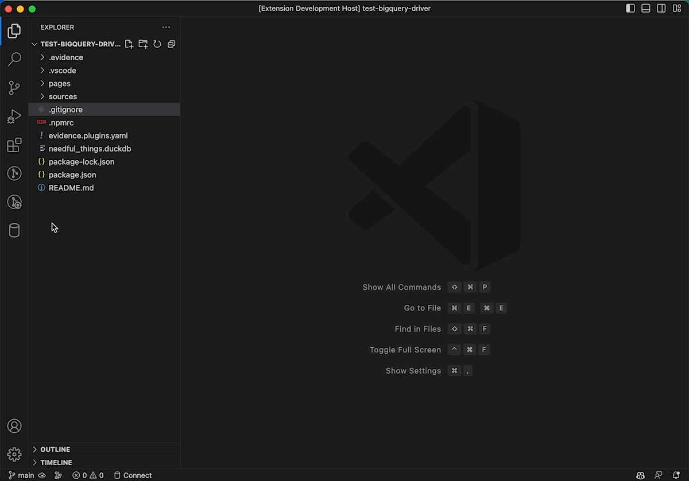

# SQLTools BiqQuery Driver

NOTE: This driver is still a work in progress. There are currently bugs and unimplemented features.

A Visual Studio Code extension which extends the [SQLTools extension](https://marketplace.visualstudio.com/items?itemName=mtxr.sqltools), with a driver to work with Google BigQuery. 

It supports: 
- Running queries on BiqQuery.
- Exploring datasets, tables and views.

## Connection

Currently only supports using a service account keyfile.

## Maintained by Evidence

This extension is a free, open source community project, maintained by [Evidence.dev](https://www.evidence.dev).

Evidence is an open source publishing tool for modern data teams, allowing you to build polished data products with just SQL and markdown.

## ToDo
- Publish to NPM / VSCode Marketplace
- Fix failures due to lack of Tables / Views
- Fix issue causing [connection-name].session.sql to be opened
- Support for other auth methods (gcloud CLI, OAuth)
- Add keywords
- Implement table preview